# 4Xs Apple Home Kit

Expose an **Axis IP camera as a native Apple HomeKit accessory** — directly from the camera, with no hub, bridge box, or cloud service. It runs as a [CamScripter](https://camstreamer.com/camscripter) microapp on the camera itself, using [HAP-NodeJS](https://github.com/homebridge/HAP-NodeJS) to speak the HomeKit Accessory Protocol.

> **Version 2.2.0** · Vendor: Pavel Kotyza · Requires CamScripter ≥ 1.5.3

Add the camera in the Apple **Home** app and you get a live camera tile, snapshots, and two motion sensors — one for AXIS Video Motion Detection (VMD4) and one for Object Analytics (AOA) — including motion notifications and HomeKit automations.

<p align="center">
  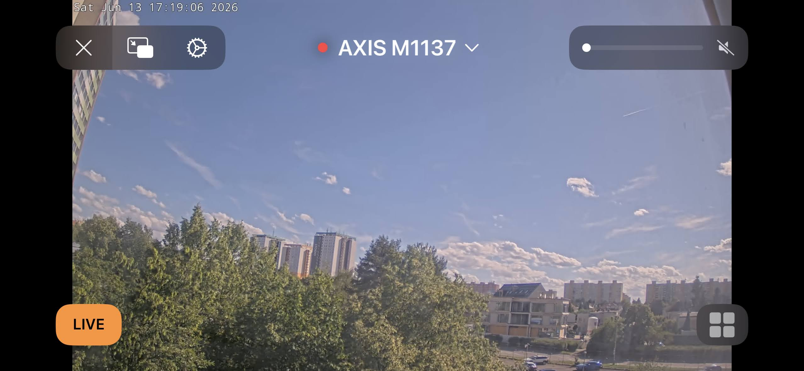
</p>
<p align="center"><sub>Full-screen live view of an AXIS M1137, streaming straight from the camera into the Apple Home app.</sub></p>

## See it in action

A quick walkthrough — pairing the camera, then live video and motion alarms landing in the Apple Home app.

<p align="center">
  <a href="https://www.youtube.com/watch?v=UpButRx2cKg">
    
  </a>
</p>
<p align="center"><sub><a href="https://www.youtube.com/watch?v=UpButRx2cKg">Watch the demo on YouTube</a></sub></p>

> A full visual walkthrough — pairing, live tiles, and motion — also lives on the project page in [`docs/`](docs/index.html).

## Features

- **Native HomeKit IP camera** — pairs straight from the Home app via a QR code or PIN; no Homebridge, no extra hardware.
- **Live video** — pulls the camera's own H.264 RTSP stream and repackages it as SRTP for iOS. Defaults to zero-transcode passthrough (`-c:v copy`) so it's light on the ARTPEC CPU, with an optional `libx264` transcode fallback for compatibility.
- **Snapshots** — VAPIX JPEG snapshots with Basic **and** Digest auth (modern AXIS OS disables Basic by default), short-lived caching so HomeKit polling doesn't hammer the camera.
- **Two motion sensors** — VMD4 and AOA each publish their own HomeKit MotionSensor (“VMD Motion Sensor” / “AOA Motion Sensor”), so you get separate notifications and automations per detector, each with a configurable hold/debounce window so a flapping detector doesn't fire a burst of notifications.
- **Audio** — OPUS audio alongside the video stream (iOS requires an advertised audio config even for video-only cameras).
- **Stable identity** — a persisted HAP "MAC" so the accessory survives restarts and stays paired.

## The settings screen — light & dark

The whole thing is configured from a single panel inside CamScripter, including a live pairing QR you scan straight into the Home app.

<p align="center">
  
  
</p>

## Pairing, step by step

From an unpaired camera to a live tile in the Home app — scanned straight from the CamScripter settings QR.

<table>
  <tr>
    <td align="center" width="25%">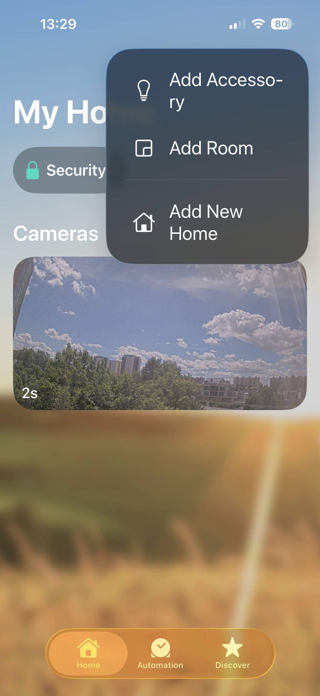<br/><b>1.</b> Tap <b>+</b> &rarr; Add Accessory</td>
    <td align="center" width="25%">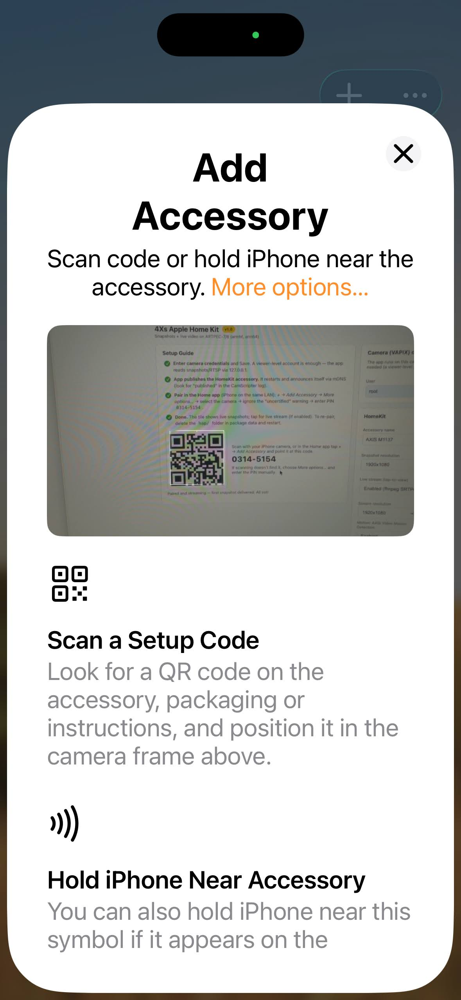<br/><b>2.</b> Scan the pairing QR</td>
    <td align="center" width="25%">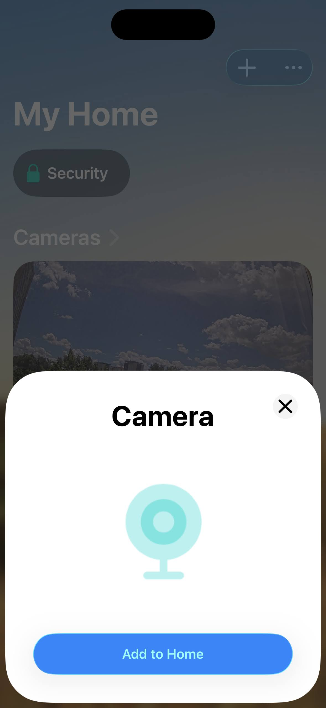<br/><b>3.</b> Add the camera to Home</td>
    <td align="center" width="25%">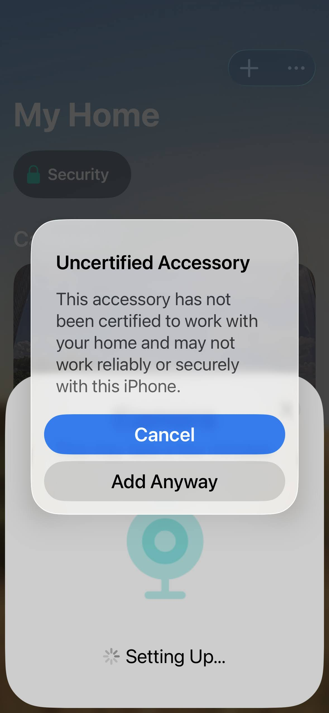<br/><b>4.</b> Allow it (<b>Add Anyway</b>)</td>
  </tr>
  <tr>
    <td align="center">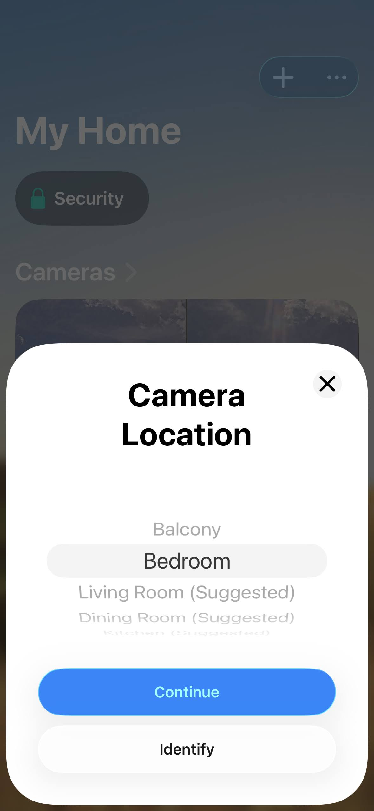<br/><b>5.</b> Pick a room</td>
    <td align="center">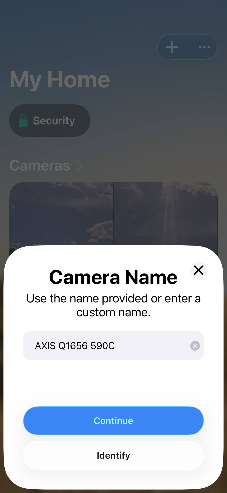<br/><b>6.</b> Name the camera</td>
    <td align="center">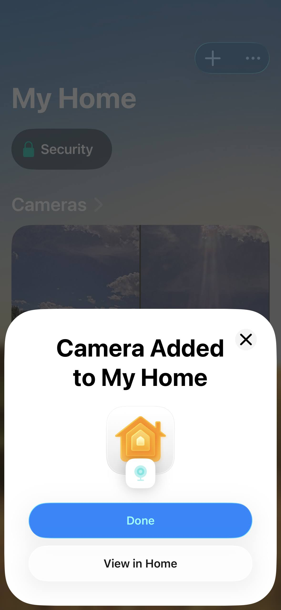<br/><b>7.</b> Done — added to Home</td>
    <td></td>
  </tr>
</table>

> **"Uncertified Accessory"?** HomeKit flags the camera this way because it isn't part of Apple's paid MFi program — tap **Add Anyway** and it works normally. The accessory page shows Manufacturer *Axis Communications*, the real model and firmware, and *HomeKit Certified: No*.

## In the Home app

Cameras show up as live tiles and full-screen streams, right alongside any other HomeKit camera.

<p align="center">
  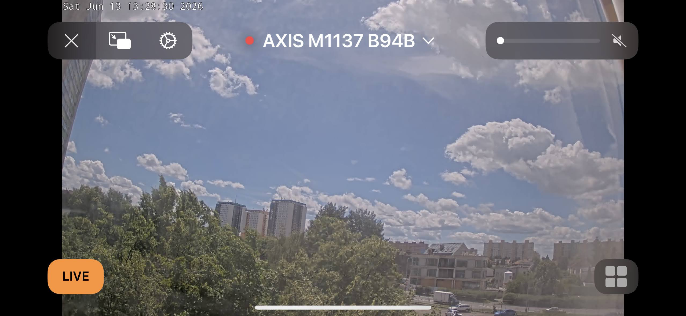
  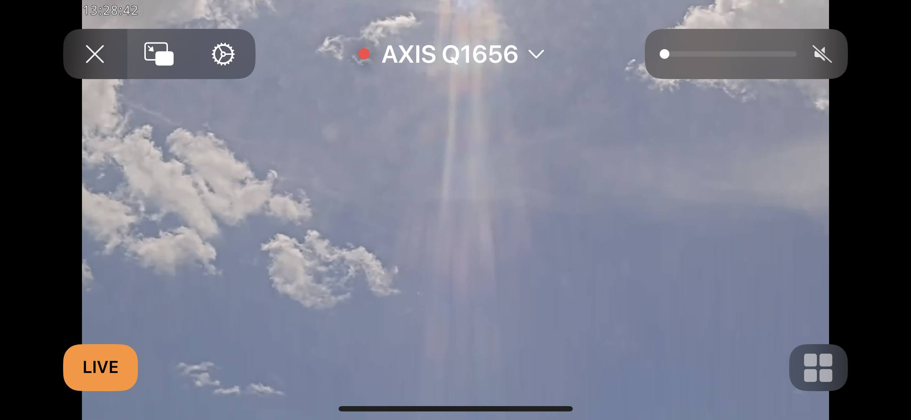
</p>
<p align="center"><sub>AXIS M1137 (left) and AXIS Q1656 (right), live.</sub></p>

<table>
  <tr>
    <td align="center" width="25%">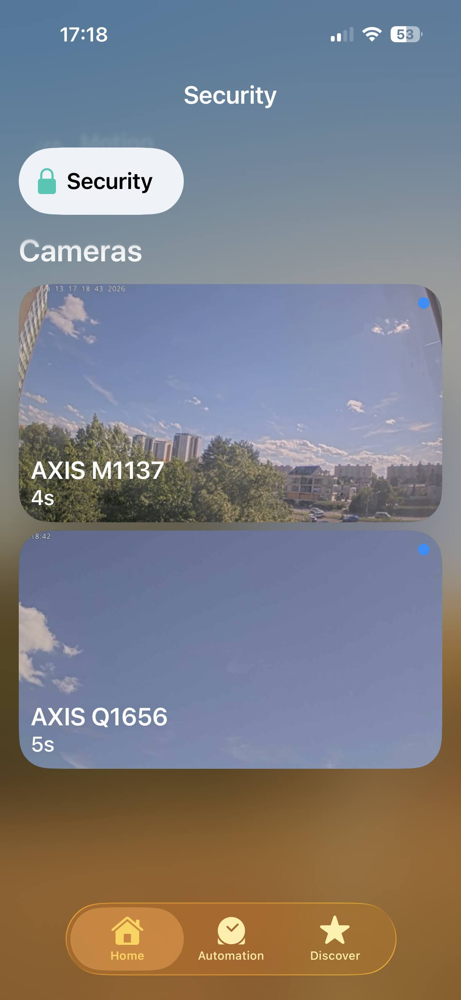<br/>Two cameras in Security</td>
    <td align="center" width="25%">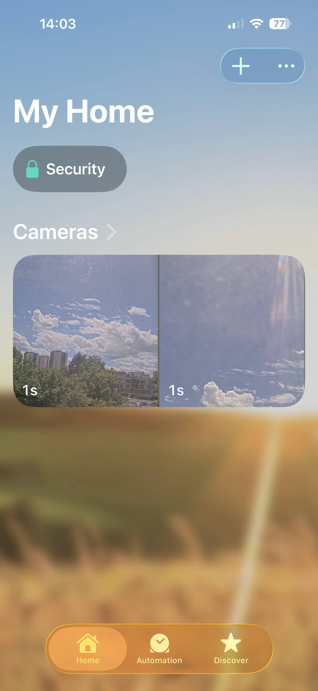<br/>Live tiles on the Home tab</td>
    <td align="center" width="25%">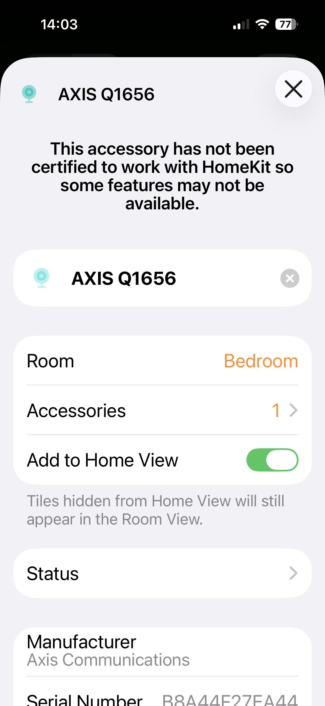<br/>Accessory settings</td>
    <td align="center" width="25%">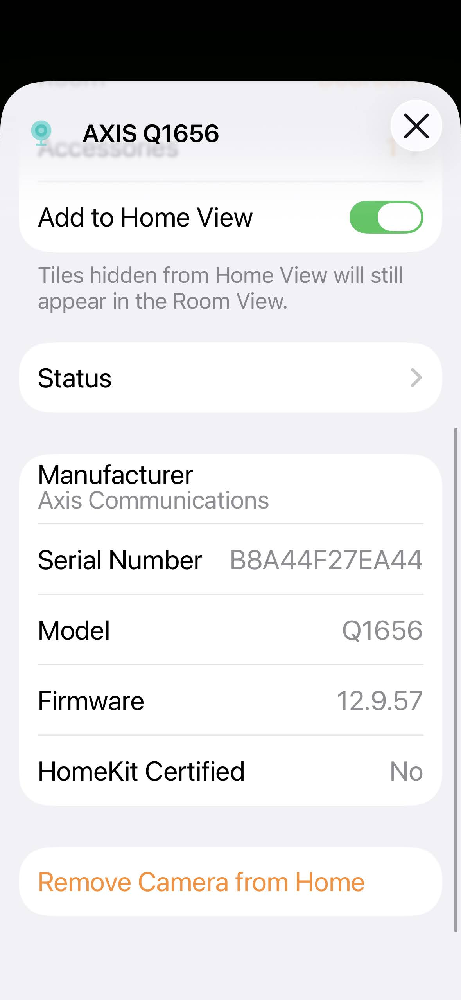<br/>Model, firmware &amp; status</td>
  </tr>
</table>

## Motion events & alarms

The app subscribes to the camera's VAPIX RuleEngine event stream and publishes VMD4 and AOA detections as **two separate HomeKit Motion Sensors** — “VMD Motion Sensor” and “AOA Motion Sensor” — each driving its own `MotionDetected` characteristic. Because they're independent sensors, you can alert on or automate from one detector without the other.

<p align="center">
  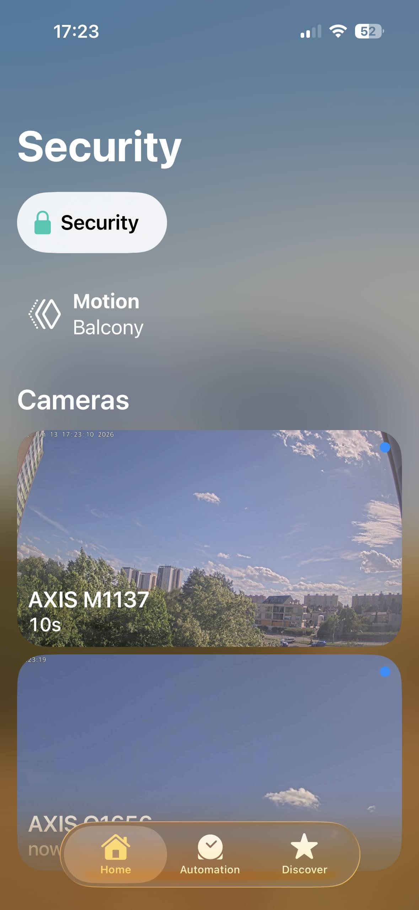
</p>
<p align="center"><sub>A motion alarm firing in the Security view.</sub></p>

**Turning on alarms (push notifications).** HomeKit does not notify by default. Enable it **per sensor**: in the Home app, long-press the sensor → **Settings** (gear) → **Status and Notifications** → turn on **Allow Notifications**. Do it once for VMD and once for AOA — so you can, say, be alerted on Object Analytics but stay quiet on raw motion.

**Hold / debounce.** The `motion_hold_s` setting keeps each sensor's `MotionDetected` true for N seconds after its last active event, so a detector that flaps on and off doesn't fire a storm of notifications. Set it to `0` to report raw on/off.

**Automations.** Each sensor is a first-class HomeKit trigger, so a detection can drive any HomeKit automation — turn on a light, run a scene, set a thermostat, or trigger other accessories — and you can build separate automations for VMD vs. AOA.

**What HomeKit tracks (and what it doesn't).** HomeKit is **stateful, not an event log**: it only knows the current state (`Motion Detected` / `Clear`) plus a "last activity" timestamp — it does **not** count events. For a real event timeline or recorded clips you need a HomeKit Secure Video camera (iCloud+) or a third-party app like Eve.

> Each sensor only reports when its detector is actually doing work — the matching app (AXIS Video Motion Detection or AXIS Object Analytics) must be running with at least one profile/scenario configured on the camera.

## Installation

1. Build the package zip — pick the bundle matching your camera's architecture (each includes the right ffmpeg binary):

   ```bash
   npm install
   npm run zip:arm64        # ARTPEC-8 / ARTPEC-9 (aarch64) — e.g. Q1656
   npm run zip:armhf        # ARTPEC-6 / ARTPEC-7 (armv7)   — e.g. M1137
   # optional: one universal package (larger — bundles both ffmpeg binaries):
   # npm run zip:package
   ```

2. In the camera UI, open **CamScripter → Apps → Upload package** and select the generated zip.
3. Open the app's settings UI and fill in the camera credentials and HomeKit options (see below).
4. In the iOS **Home** app: **+ → Add Accessory**, scan the QR code shown in the settings UI (or enter the PIN), then **More options** if it isn't auto-discovered.

## Configuration

Settings are validated with [zod](https://zod.dev) (`src/schema.ts`) and stored in `settings.json`. Defaults:

### Camera

| Setting | Default | Notes |
| --- | --- | --- |
| `protocol` | `http` | `http` or `https` |
| `ip` | `127.0.0.1` | usually localhost — the app runs on the camera |
| `port` | `80` | |
| `user` / `pass` | — | account needs at least viewer rights |

### HomeKit

| Setting | Default | Notes |
| --- | --- | --- |
| `name` | `Axis Camera` | accessory name shown in Home |
| `pincode` | `031-45-154` | pairing PIN, format `XXX-XX-XXX` |
| `port` | `51826` | HAP port |
| `live_stream` | `true` | `true` = SRTP live view, `false` = snapshot-only |
| `snapshot_resolution` | `1920x1080` | |
| `stream_resolution` | `1920x1080` | |
| `stream_fps` | `30` | 1–60 |
| `audio_enabled` | `true` | OPUS audio in the stream |
| `video_mode` | `copy` | `copy` (passthrough) or `transcode` (libx264 fallback) |
| `stream_bitrate_kbps` | `0` | 0 = camera default |
| `motion_vmd` | `true` | enable AXIS Video Motion Detection sensor |
| `motion_aoa` | `true` | enable AXIS Object Analytics sensor |
| `motion_hold_s` | `5` | keep "detected" N s after last event (0–300); debounce |
| `debug` | `false` | verbose logging (`DEBUG=HAP-NodeJS:*`, ffmpeg verbose) |

## Project layout

```
src/
  bootstrap.ts   Entry point — sets HAP debug env before hap-nodejs loads, then requires main
  main.ts        Builds & publishes the HomeKit accessory, wires camera + motion services
  schema.ts      zod settings schema and TSettings type
  snapshot.ts    VAPIX JPEG snapshot fetch with Basic/Digest auth + caching
  stream.ts      FfmpegStreamingDelegate — RTSP → SRTP live streaming (copy/transcode)
  motion.ts      MotionMonitor — VAPIX VMD4/AOA events → HomeKit MotionDetected
  peers.ts       PeerMonitor — mDNS discovery of sibling bridges on the LAN
  constants.ts   Snapshot timeouts, fixed HomeKit setup ID
  logger.ts      Timestamped console logger with a debug toggle
html/            Settings UI (index.html, index.js, QR code generation)
bin/             ffmpeg fetch + package zip helper scripts
docs/            GitHub Pages site (index.html + img/)
manifest.json    CamScripter package manifest
```

## Development

```bash
npm install
npm run build                 # tsc → dist/
npm run try                   # build + run locally with PERSISTENT_DATA_PATH=./localdata/
```

Saving settings sends `SIGINT`; CamScripter then restarts the app with the new config — so the process intentionally idles rather than exits when credentials are missing.

## Tech

TypeScript · [camstreamerlib](https://www.npmjs.com/package/camstreamerlib) v3 · [hap-nodejs](https://github.com/homebridge/HAP-NodeJS) · zod · bundled static ffmpeg (ARM).

## License

See repository. © Pavel Kotyza.
